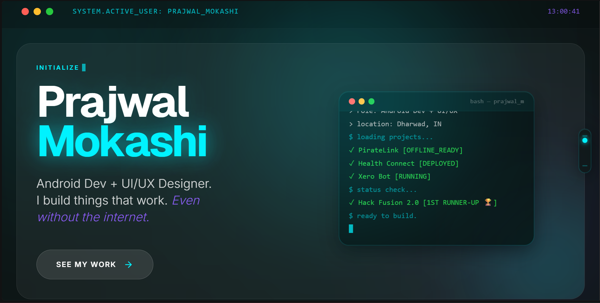

<div align="center">
  
</div>

# 🌐 DevFolio — Prajwal Mokashi

> Personal portfolio website built with a terminal OS aesthetic, Liquid Glass glassmorphism UI, and cinematic animations.

[](https://prajwalmokashi.vercel.app)
[](https://linkedin.com/in/prajwalmokashi)

---

## ✨ Features

- **Terminal Boot Sequence** — Hero section simulates a system initializing with typed output and glitch effects on the name
- **Liquid Glass UI** — Glassmorphism cards with `backdrop-filter` blur, cyan/violet accent palette, and dark teal background
- **Animated Terminal Window** — Live-typed project status in the hero section (`bash — prajwal_mokashi`)
- **Interactive Nav Dial** — Custom floating navigation pill with scroll-sync, drag-to-navigate on mobile, and hover-expand on desktop
- **Project Carousels** — Auto-playing swipeable image carousels per project card
- **Glitch Name Effect** — CSS `clip-path` glitch animation on page load and hover
- **Skill Matrix** — Animated progress bars with tech stack tags
- **Experience Timeline** — Vertical timeline with glassmorphism cards
- **OS-Style Header** — Real-time clock and `SYSTEM.ACTIVE_USER` label
- **STATUS: ONLINE Footer** — Terminal-style latency and status bar
- **Fully Responsive** — Mobile-first with desktop enhancements

---

## 🛠 Tech Stack

| Layer | Technology |
|---|---|
| **Framework** | React (via Google AI Studio) |
| **Styling** | CSS-in-JS / Tailwind CSS |
| **Animations** | CSS Keyframes + Framer Motion |
| **Deployment** | Vercel |
| **Font** | JetBrains Mono + Space Grotesk |
| **Icons** | Lucide React |

---

## 🎨 Design System

```
Background:   #0D1515  (Dark Teal-Black)
Accent Cyan:  #00F2FF
Accent Violet:#8B5CF6
Text Primary: #FFFFFF
Text Muted:   #AAAAAA
Card BG:      rgba(255, 255, 255, 0.05)
Card Border:  rgba(0, 242, 255, 0.15)
```

**Aesthetic:** Liquid Glass Glassmorphism — dark, premium, futuristic. Like a terminal OS that's been redesigned by someone who cares too much about UI.

---

## 📁 Project Structure

```
Prajwal-Mokashi-Devfolio/
├── public/
│   └── images/
│       ├── profile/
│       │   └── prajwal-profile.png
│       ├── projects/
│       │   ├── piratelink/
│       │   │   ├── piratelink-1.png
│       │   │   ├── piratelink-2.png
│       │   │   └── piratelink-3.png
│       │   ├── healthconnect/
│       │   │   ├── healthconnect-1.png
│       │   │   └── healthconnect-2.png
│       │   ├── xerobot/
│       │   │   ├── xerobot-1.png
│       │   │   └── xerobot-2.png
│       │   └── cinescope/
│       │       ├── cinescope-1.png
│       │       └── cinescope-2.png
│       └── misc/
│           └── hack-fusion-trophy.png
├── src/
│   ├── components/
│   │   ├── Hero.jsx
│   │   ├── Identity.jsx
│   │   ├── Projects.jsx
│   │   ├── Experience.jsx
│   │   ├── Skills.jsx
│   │   ├── Contact.jsx
│   │   └── NavDial.jsx
│   ├── App.jsx
│   └── index.css
└── README.md
```

---

## 🚀 Projects Featured

### 🏴‍☠️ PirateLink
Offline-first peer-to-peer Android chat app using Google Nearby Connections API. No internet. No servers. Zero cloud costs.

`Kotlin` `Nearby Connections API` `XML` `Figma` `Android Studio`

### 🏥 Health Connect
Real-time healthcare appointment overbooking stabilizer. Built in 24 hours at Hack Fusion 2.0 — won **1st Runner-Up 🏆** at national level.

`React 18` `Node.js` `PostgreSQL` `Socket.IO` `Figma`

### 🤖 Xero Bot
Offline AI chatbot running 100% locally using Ollama and open-source models. No API keys. No subscriptions. No data leaving your device.

`Python` `Ollama` `Docker` `Local LLMs`

### 🎬 CineScope
Full-stack streaming discovery and watchlist app leveraging TMDB API for real-time data.

`Next.js` `Firebase` `TMDB API` `Tailwind CSS`

---

## 🏆 Achievements

- 🥈 **1st Runner-Up** — Hack Fusion 2.0 (National Level Hackathon, May 2026)
- 📱 Built PirateLink — offline-first Android app with zero internet dependency
- 🌐 500+ LinkedIn connections | 650+ followers

---

## 📦 Running Locally

```bash
# Clone the repository
git clone https://github.com/prajwalnmokashi03/Prajwal-Mokashi-devfolio-.git

# Navigate to project
cd devfolio

# Install dependencies
npm install

# Start development server
npm run dev

# Build for production
npm run build
```

---

## 🌍 Deployment

Deployed on **Vercel** with automatic deployments on every push to `main`.

```bash
# Deploy manually
vercel --prod
```

---

## 📬 Contact

| Platform | Link |
|---|---|
| **Portfolio** | [prajwalmokashi.vercel.app](https://prajwalmokashi.vercel.app) |
| **LinkedIn** | [linkedin.com/in/prajwalmokashi](https://linkedin.com/in/prajwalmokashi) |
| **GitHub** | [github.com/prajwalnmokashi03](https://github.com) |
| **Email** | prajwalmokashi03@gmail.com |

---

## 📄 License

MIT License — feel free to take inspiration, but please don't copy directly.
If you use this as a reference, a ⭐ on the repo would be appreciated!

---

<div align="center">

**Built with obsessive attention to detail at 2AM. 🏴‍☠️**

*"I build things that work. Even without the internet."*

</div>